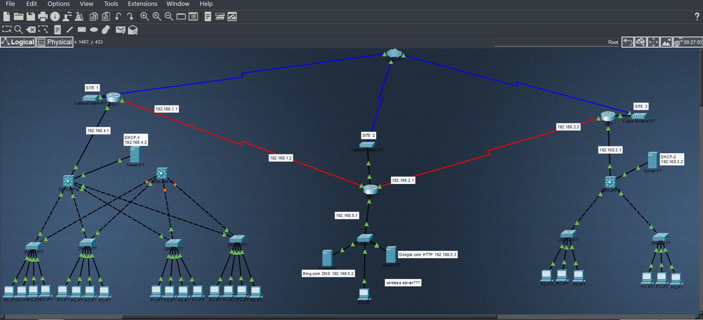

# Small Law Firm Network Infrastructure

A Cisco Packet Tracer network design and implementation project for a small law firm. The network is designed to provide reliable connectivity, IP telephony, network segmentation, secure device management, and isolated guest wireless access.



---

## Project Overview

This project simulates the network infrastructure of a small law firm consisting of three attorneys, one paralegal, and one receptionist.

Each employee is provided with:

* 1 PC
* 1 IP phone

The network is designed using VLAN segmentation to separate attorney and paralegal data traffic while providing shared access to network services where appropriate.

The reception area also includes a shared network printer configured with a static IP address. A conference room provides guest Wi-Fi access that is separated from the firm's internal network.

The network was designed and configured using Cisco Packet Tracer.

---

## Business Requirements

The law firm requires a network capable of supporting:

* Three attorneys
* One paralegal
* One receptionist
* Five employee PCs
* Five IP phones
* One shared network printer
* Conference room guest Wi-Fi
* Segmented employee traffic
* IP telephony
* Automatic IP addressing
* Secure network device management
* Reliable inter-VLAN communication
* Isolated guest network access

---

## Network Objectives

The primary objectives of this project are to:

1. Deploy and configure access switches.
2. Create separate VLANs for different types of network traffic.
3. Configure trunk links between network devices.
4. Implement inter-VLAN routing.
5. Configure DHCP for client devices.
6. Configure IP telephony services.
7. Provide secure management access to network devices.
8. Configure a dedicated VLAN for the shared network printer.
9. Provide guest Wi-Fi in the conference room.
10. Prevent guest devices from accessing internal company networks.
11. Verify end-to-end network connectivity.
12. Document the complete network configuration.

---

## Network Design

The network uses VLAN segmentation to separate different categories of traffic.

### VLAN Structure

| VLAN | Purpose        | Devices                   |
| ---: | -------------- | ------------------------- |
|   10 | Attorney Data  | 3 Attorney PCs            |
|   20 | Paralegal Data | 1 Paralegal PC            |
|   30 | Reception Data | Reception PC              |
|   40 | Voice          | 5 IP Phones               |
|   50 | Printer        | Shared Network Printer    |
|   60 | Guest Wi-Fi    | Conference Room Guests    |
|   99 | Management     | Network Device Management |

The VLAN assignments provide logical separation between employee data, voice traffic, printer traffic, guest traffic, and network management.

---

## End Devices

### Attorneys

Three attorneys are connected to the network.

Each attorney has:

* PC
* IP phone

Attorney PCs are assigned to the Attorney Data VLAN.

### Paralegal

The paralegal has:

* PC
* IP phone

The paralegal's data traffic is separated from attorney traffic using a dedicated VLAN.

### Reception

The receptionist has:

* PC
* IP phone

The reception area also contains a shared network printer.

The printer uses a static IP address and is assigned to its own dedicated VLAN.

### Conference Room

The conference room provides wireless guest access.

Guest wireless devices are placed into a dedicated Guest VLAN and are prevented from accessing internal law firm networks.

---

## Network Services

The project implements the following network services and technologies:

* VLANs
* Inter-VLAN routing
* DHCP
* IP telephony
* Voice VLAN
* Trunking
* Access ports
* Static IP addressing
* Secure management access
* Guest wireless networking
* Network segmentation
* Routing
* Network verification

---

## IP Addressing

The network uses private IPv4 addressing.

Each VLAN is assigned its own subnet, with the default gateway provided by the Layer 3 routing device.

The network printer is configured with a static IP address.

Employee PCs receive their addresses dynamically through DHCP.

IP phones receive their network configuration through the voice network configuration.

A complete addressing table will be documented in:

`Documentation/IP-Addressing-Plan.md`

---

## VLAN Segmentation

VLAN segmentation is a major component of the network design.

### Attorney VLAN

The three attorney PCs are placed into a dedicated data VLAN.

This prevents attorney data traffic from sharing the same Layer 2 broadcast domain as the paralegal and reception networks.

### Paralegal VLAN

The paralegal is assigned to a separate VLAN from the attorneys.

This demonstrates how network segmentation can be used to separate departments within a small organization.

### Reception VLAN

The receptionist's PC is assigned to its own data VLAN.

### Voice VLAN

All five IP phones use a dedicated Voice VLAN.

This separates voice traffic from employee data traffic and allows the network to treat IP telephony traffic independently.

### Printer VLAN

The shared network printer is placed into its own VLAN and uses a static IP address.

### Guest VLAN

Conference room wireless clients are placed into a dedicated Guest VLAN.

Guest traffic is separated from the firm's internal networks.

### Management VLAN

Network infrastructure devices use a dedicated Management VLAN for administrative access.

---

## Inter-VLAN Routing

Because the network uses multiple VLANs, routing is required for devices in different VLANs to communicate.

Inter-VLAN routing is configured on the network's routing device.

The router provides the default gateway for each VLAN and allows controlled communication between the appropriate networks.

---

## DHCP

DHCP is used to automatically assign IP configuration information to employee devices.

DHCP provides:

* IP address
* Subnet mask
* Default gateway
* DNS information

The network printer is excluded from DHCP because it requires a static IP address.

---

## IP Telephony

Each employee is equipped with an IP phone.

The network uses a dedicated Voice VLAN for IP telephony traffic.

The project demonstrates:

* Voice VLAN configuration
* IP phone connectivity
* IP addressing for phones
* IP telephony service configuration
* Phone registration
* Voice network verification

---

## Secure Management Access

Network devices are configured for secure administrative access.

The management design includes:

* Management VLAN
* Local administrator credentials
* Secure remote management
* Device identification
* Password protection
* Restricted management access

SSH is used where supported to provide encrypted remote management instead of relying on unsecured Telnet access.

---

## Guest Wi-Fi Security

The conference room provides wireless Internet access for guests.

Guest devices are placed into a dedicated Guest VLAN.

The guest network is designed to prevent wireless visitors from accessing internal law firm resources such as:

* Attorney devices
* Paralegal devices
* Reception devices
* Network management interfaces
* Internal infrastructure

This provides logical separation between visitors and the firm's internal network.

---

## Cabling and Connectivity

The physical topology includes Ethernet connections between:

* PCs and IP phones
* IP phones and access switches
* Access switches and routing infrastructure
* Network printer and access switch
* Wireless access point and network infrastructure

The project also demonstrates proper access-port and trunk-port configuration.

---

## Switch Configuration

The access switch configuration includes:

* VLAN creation
* VLAN assignment
* Access ports
* Voice VLAN assignment
* Trunk ports
* Management configuration
* Secure management access

---

## Routing Configuration

The routing configuration provides:

* Inter-VLAN routing
* Default gateways
* Routing between required VLANs
* Connectivity to network services
* Guest network isolation

---

## Network Verification

After configuration, the network is tested to verify proper operation.

Testing includes:

### Connectivity

* PC-to-default-gateway testing
* PC-to-PC testing
* Inter-VLAN connectivity
* Printer connectivity
* IP phone connectivity

### VLAN Verification

VLAN assignments are verified using switch commands such as:

```text
show vlan brief
```

### Trunk Verification

Trunk links are verified using:

```text
show interfaces trunk
```

### IP Configuration

Device addressing is verified using:

```text
show ip interface brief
```

### Routing

Routing configuration is verified using:

```text
show ip route
```

### DHCP

DHCP operation is verified by confirming that client devices receive the correct:

* IP address
* Subnet mask
* Default gateway
* DNS server

### IP Telephony

IP phones are verified to ensure that they:

* Receive an IP address
* Join the Voice VLAN
* Register with the configured telephony service
* Can communicate across the network

### Guest Network

Guest wireless connectivity is tested to verify that:

* Guest devices receive an IP address
* Guests can reach permitted network services
* Guest devices cannot access internal law firm VLANs

---

## Technologies Used

* Cisco Packet Tracer
* Cisco IOS
* Ethernet
* IPv4
* VLANs
* 802.1Q Trunking
* Inter-VLAN Routing
* DHCP
* IP Telephony
* Wireless Networking
* SSH
* Network Security
* ACLs
* Network Troubleshooting

---

## Project Documentation

Additional project documentation can be found in:

`Documentation/`

This includes:

* Network requirements
* Network design
* IP addressing plan
* VLAN plan
* Security implementation

---

## Project Status

**Status:** In Progress

The network is being built, configured, tested, and documented in Cisco Packet Tracer.

Future updates will include configuration screenshots, verification results, troubleshooting documentation, and the completed Packet Tracer topology.

---

## Author

**Zakari Gilmer**

Cisco Networking Project
Small Law Firm Network Infrastructure
